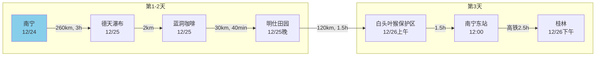
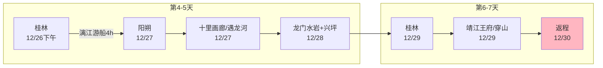
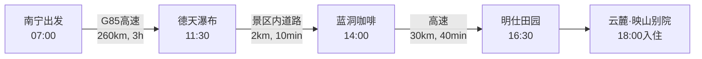
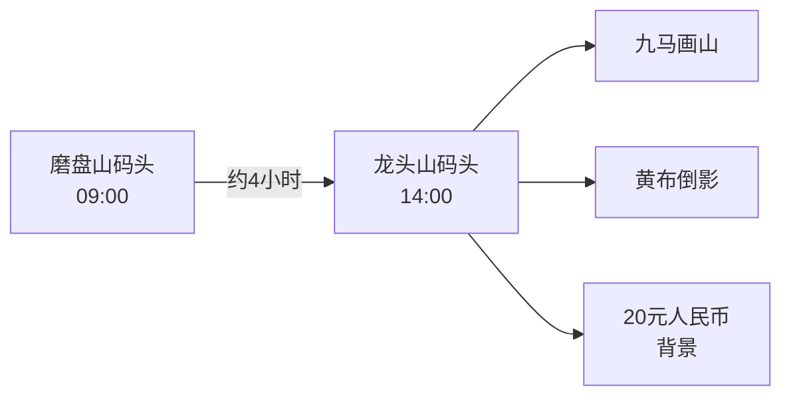



**行程概览：** 南宁集合 → 德天跨国瀑布 → 阳朔漓江 → 龙脊梯田 → 桂林返回

**最佳旅行时间：** 12月-次年1月，气候温和，避开夏季高温和雨季

**预算预估：** 总费用约¥2500-3500/人（交通+住宿+餐饮+门票）

**行程亮点：**
- 🏔️ 亚洲最宽跨国瀑布（德天瀑布）
- 🏞️ 桂林山水甲天下的漓江风光
- 🌄 联合国教科文遗产龙脊梯田
- 🏮 南宁民族风情和美食

## 🏨 住宿安排汇总

| 日期 | 城市 | 酒店名称 | 地址 | 房型/权益 |
| :--- | :--- | :--- | :--- | :--- |
| **12/24** (1晚) | 南宁 | **南宁饭店** 📞 0771-2103888 | 兴宁区民生路38号 | 14:00退房 |
| **12/25** (1晚) | 大新 | **云麓·映山别院（大新明仕店）** 📞 19336175678 | 堪圩乡明仕村那关屯36号 | **越居山景大床房** 含早、Mini bar、边境红糖 |
| **12/27** (2晚) | 阳朔 | **聚龙•小镇（遇龙河店）** 📞 15677365882 | 阳朔镇矮山村委鸡窝渡村168号 | **观山榻榻米双床房** 含早、西街接送、旅拍、围炉煮奶茶 |
| **12/29** (1晚) | 桂林 | **桂林白公馆酒店** 📞 0773-8999888 | 秀峰区榕湖北路16号4号楼 | - |

## 🚗 租车信息

| **车型**  | 理想 L6  |
| --- | --- |
| **订单号** | 1128143911615272 |
| **提车号** | 1128143911672214 |
| **取车时间** | 12月24日 17:30 |
| **还车时间** | 12月26日 17:30（共2天） |
| **取车地点** | 吴圩国际机场（免费送车上门） |
| **还车地点** | 南宁站（收费上门取车） |
| **租车电话** | 13044102602 |

## 第一天：12/24 南宁集合日

🏩 **住宿：** 南宁饭店（地铁1号线朝阳广场站附近）

### 日程安排

| 时间    | 活动     | 具体信息        | 备注                         |
| ----- | ------ | ----------- | -------------------------- |
| 16:05 | Iris抵达 | 吴圩机场 → 南宁饭店 | 自驾（理想 L6） |
| 17:45 | Meg抵达  | 同上到酒店       | 自驾（理想 L6） |
| 19:30 | 晚餐     | **三街两巷**美食街 | 必吃：复记老友粉、甘家界柠檬鸭            |
| 20:30 | 夜游     | **邕江夜游**    | 票价100元，最后一班21:00           |

### 图片

*三街两巷历史街区夜景*

*邕江夜游*

### 地图导航

  
#### 机场至酒店路线
<iframe src="https://maps.google.com/maps?saddr=南宁吴圩国际机场&daddr=南宁饭店&output=embed" width="100%" height="400"></iframe>

#### 三街两巷美食街位置
<iframe src="https://maps.google.com/maps?q=三街两巷&output=embed" width="100%" height="400"></iframe>

---

## 第二天：12/25 南宁 → 德天瀑布 → 明仕田园

🏩 **住宿：** 云麓·映山别院（大新明仕店）

🚗 **交通安排：** 租车自驾（约300元/天，07:00出发）

### 行程路线图

### 详细景点安排

| 时间          | 景点         | 门票         | 游玩要点                     |
| ----------- | ---------- | ---------- | ------------------------ |
| 11:30-14:00 | **德天跨国瀑布** | ¥125（含接驳车） | 53号界碑、越南商品街、登高望越         |
| 14:30-15:30 | **蓝洞咖啡**   | 咖啡¥48/杯    | 洞穴内观瀑布，需提前预约0771-5629888 |
| 16:30-18:00 | **明仕田园**   | ¥120（含竹筏）  | 骑行、日落、竹筏漂流               |

### 德天瀑布亮点
- 🌊 亚洲最宽跨国瀑布（宽200米，高70米）
- 📍 **53号界碑：** 见证中越边境历史
- 🛍️ **越南商品街：** 体验边贸文化

### 明仕田园特色
- 🎋 36景式山水田园风光
- 🚣 竹筏漂流体验
- 🌅 日落观景最佳位置

### 图片

*德天瀑布*

*明仕田园*

### 地图导航

  
#### 南宁市到德天瀑布
<iframe src="https://maps.google.com/maps?saddr=南宁市&daddr=德天瀑布&output=embed" width="100%" height="400"></iframe>

#### 明仕田园
<iframe src="https://maps.google.com/maps?saddr=德天瀑布&daddr=明仕田园&output=embed" width="100%" height="400"></iframe>

---

## 第三天：12/26 明仕 → 白头叶猴 → 南宁 → 桂林

⚠️ **本日行程紧张，务必06:00起床**

| 时间          | 活动              | 交通        | 关键信息                      |
| ----------- | --------------- | --------- | ------------------------- |
| 06:30-08:00 | 前往白头叶猴保护区      | 自驾120km   | 经合那高速，约1.5小时               |
| 08:30-10:30 | 白头叶猴生态游        | 景区内徒步     | 门票¥80，观猴最佳时间09:00-11:00    |
| 10:30-12:00 | 返回南宁东站         | 自驾        | 还车、快速午餐（崇善米粉）             |
| 14:00-16:30 | 南宁→桂林高铁        | ¥120-180  | 建议预订14:00车次               |
| 18:00-18:40 | 象鼻山            | ¥55       | 傍晚黄金光线，拍摄倒影                |
| 19:00-20:00 | 日月双塔           | 免费        | 亮灯时间19:00，杉湖栈道拍倒影         |
| 20:00-21:30 | 正阳路步行街         | 步行        | 晚餐：石记米粉                   |

### 图片

*白头叶猴保护区*

*象鼻山*

*日月双塔*

*正阳路步行街*

---

## 第四天：12/27 桂林 → 阳朔（漓江精华段）

🏩 **住宿：** 聚龙•小镇（阳朔十里画廊遇龙河店）

🚢 **漓江游船预订信息：**
- **码头：** 磨盘山码头 → 龙头山码头
- **推荐班次：** 10:00（光线最佳）
- **票价：** 四星船¥360/人（含午餐盒饭）
- **预订方式：** 携程搜索"漓江四星船"提前3天订

### 漓江游船路线图

| 时间          | 活动       | 费用       | 注意事项                      |
| ----------- | -------- | -------- | ------------------------- |
| 14:00-15:00 | 前往酒店     | 打车¥25    | 龙头山码头→聚龙小镇               |
| 15:00-17:30 | 十里画廊骑行   | 租车¥40/天 | 路线：蝴蝶泉→大榕树→月亮山→工农桥      |
| 17:30-19:00 | 遇龙河竹筏    | ¥180/筏  | 水厄底→综合码头，经过4个坝           |
| 19:30-20:30 | 渔火节      | 免费       | 河畔酒店附近，或《印象·刘三姐》¥268    |
| 21:00       | 西街啤酒鱼    | ¥80/人    | 谢三姐/大师傅啤酒鱼               |

📸 
### 图片

*十里画廊骑行*

*遇龙河竹筏漂流*

*渔火节*

*西街啤酒鱼*

---

## 第五天：12/28 阳朔探洞+兴坪古镇

🚗 **包车安排：** 全天包车约¥300（龙门水岩含接送）

| 时间          | 景点         | 费用       | 体验亮点                        |
| ----------- | ---------- | -------- | --------------------------- |
| 09:00-12:00 | 龙门水岩探洞     | ¥260/人   | 泥浆浴、溯溪、洞穴探险（需带换洗衣物）       |
| 14:00-16:00 | 兴坪古镇       | 免费       | 老街漫步，宁静古朴                   |
| 16:00-18:00 | 20元人民币背景   | 免费       | 导航"旺旺鱼庄"，下午光线最佳           |
| 18:00-19:00 | 千里江山图日落   | 免费       | 老寨山登山30分钟，视野绝佳但台阶陡峭       |

### 图片

*龙门水岩探洞*

*兴坪古镇*

*20元人民币背景*

*千里江山图日落*

---

## 第六天：12/29 阳朔→桂林

� **住宿：** 桂林白公馆酒店（象鼻山两江四湖店）

�🌅 **可选项目：** 相公山日出（需04:30起床）

| 项目          | 时间          | 费用        | 备注                          |
| ----------- | ----------- | --------- | --------------------------- |
| 相公山日出       | 05:30-07:30 | ¥60      | 包车¥150往返，山顶拍摄漓江第一湾         |
| 返回桂林       | 09:00-10:30 | 大巴¥25     | 阳朔汽车站→桂林汽车南站              |
| 靖江王府       | 14:00-16:00 | ¥100      | 含独秀峰，登山顶俯瞰桂林               |
| 逍遥楼        | 16:30-17:00 | 免费        | 解放桥旁，唐代风格建筑                 |
| 穿山月岩咖啡     | 17:30-19:00 | 门票¥12    | 别有洞天咖啡馆，冰椰美式¥38           |

### 图片

*相公山日出*

*靖江王府*

*逍遥楼*

*穿山月岩咖啡*

---

## 第七天：12/30 返程

**返程安排：** 根据航班时间，提前2-3小时到达桂林两江机场
- **交通：** 民航大厦机场大巴（25元/人，约50分钟）或打车（80-100元）

## 🍜 广西美食地图

| 城市   | 必吃美食 | Top 3店铺              | 人均     | 营业时间          |
| ---- | ---- | -------------------- | ------ | ------------- |
| 南宁   | 老友粉  | 复记老友粉、舒记老友粉        | ¥15    | 07:00-21:00  |
| 南宁   | 柠檬鸭  | 甘家界柠檬鸭            | ¥60    | 11:00-21:00  |
| 德天   | 越南鸡肉粉 | 景区越南街               | ¥25    | 09:00-18:00  |
| 明仕   | 竹筒鸡 | 酒店餐厅            | ¥80    | 12:00-20:00  |
| 桂林   | 桂林米粉 | 崇善米粉、石记米粉          | ¥10    | 06:30-15:00  |
| 阳朔   | 啤酒鱼  | 谢三姐、大师傅啤酒鱼        | ¥80    | 11:00-22:00  |
| 兴坪   | 啤酒鱼  | 旺旺鱼庄               | ¥60    | 11:00-20:00  |

## ⚠️ 关键提醒

### 🔴 必须提前预订的项目
- 漓江四星船票：至少提前3天（携程/飞猪）
- 遇龙河竹筏：提前1天（公众号"遇龙河竹筏"）
- 龙门水岩探洞：提前1天（电话19069617081）
- 相公山包车：提前1天（阳朔当地旅行社）

### 🟡 时间敏感点
- D3白头叶猴保护区08:30前必须到达
- D4磨盘山码头需提前1小时取票
- D6相公山日出需04:30出发

### 🟢 Tips
- 桂林米粉在早上吃最正宗且便宜
- 十里画廊骑行别停收费观景台
- 兴坪老寨山免费且比相公山视野好
